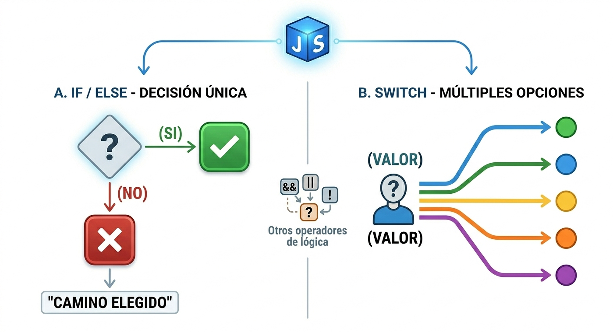

# Condicionales

Los condicionales son estructuras de control que permiten tomar decisiones en un programa según si se cumple o no una determinada condición. Son fundamentales porque permiten que el programa no  haga siempre lo mismo , sino que pueda reaccionar a diferentes situaciones.&#x20;

Sirven para:

* Ejecutan diferentes bloque de codigo segun las condiciones.
* Validar **entradas de usuario** (por ejemplo, contraseñas)
* Tomar decisiones en **lógica de negocio** (por ejemplo, calcular descuentos según edad).
* Controlar **flujo de ejecución** de manera dinámica y flexible.

Tipos de condicionales en JavaScript

*   **IF** \
    Ejecuta el código si la condicion es verdadera.\
    En este ejemplo el operador de igualdad estricta `===` compara que sean iguales y  como son iguales  devuelve `true` y ejecuta el blo que código dentro de `{}`.\
    \
    Sintaxis:

    ```javascript
    if (condición) {
        // Bloque de código que se ejecuta si la condición es true
    }
    ```

    \
    Ejemplo:
* ```javascript
  let lenguaje = "JavaScript";

  if (lenguaje === "JavaScript") {
      console.log("¡Genial! Estás aprendiendo el lenguaje más popular.");
  }
  ```


*   **IF...ELSE**\
    Permite ejecutar un bloque si la condición es verdadera, y otro bloque si es falsa. En el ejemplo siguiente  se evalua la condicion como no se cumple en el **if** entonces  ejecuta el bloque de codigo del **else**.\
    \
    Sintaxis:

    ```javascript
    if (condición) {
        // Bloque si la condición es true
    } else {
        // Bloque si la condición es false
    }
    ```

    \
    Ejemplo:

    ```javascript
    let lenguaje = "Python";

    if (lenguaje === "JavaScript") {
        console.log("Estás aprendiendo JavaScript");
    } else {
        console.log("No estás aprendiendo JavaScript, prueba con él"); 
    }
    ```
*   **ELSE IF**\
    Para varias alternativas.\
    Se evalúa la primera condición si es true ejecuta el bloque y termina, si es false, pasa al siguiente `else if` si ninguna se cumple, se ejecuta el `else`. Se evalua de arriba hacia abajo, sol se ejecuta el primer bloque `true`  en el caso de que no haya ninguno verdadero ejecutara el `else`.\
    \
    Sintaxis:

    ```javascript
    if (condición1) {
        // Bloque si condición1 es true
    } else if (condición2) {
        // Bloque si condición2 es true
    } else {
        // Bloque si ninguna condición anterior es true
    }
    ```

    \
    Ejemplo:

    ```javascript
    let lenguaje = "Java";

    if (lenguaje === "JavaScript") {
        console.log("Front-end o Full-Stack");
    } else if (lenguaje === "Python") {
        console.log("Data Science y Back-end");
    } else if (lenguaje === "Java") {
        console.log("Aplicaciones corporativas");
    } else {
        console.log("Otro lenguaje interesante");
    }

    ```
*   SWITCH\
    Se usa cuando tienes muchas opciones posibles para una sola variable. Es más organizado que escribir diez `else if` seguidos. Se compara el valor con `case` y en el caso de que encuentre el valor detiene la ejecución con `break` para que no sigua probando con los demás casos, si no coincide  con ninguno se ejecuta el caso por defecto `defaulf` .\
    \
    Sintaxis:

    ```javascript
    switch (expresión) {
        case valor1:
            // Bloque si expresión === valor1
            break;
        case valor2:
            // Bloque si expresión === valor2
            break;
        // Puedes tener todos los casos que necesites
        default:
            // Bloque si ningún case coincide
    }
    ```

    \
    \
    Ejemplo:

    ```javascript
    let lenguaje = "C++";

    switch (lenguaje) {
        case "JavaScript":
            console.log("Se usa para web y apps móviles");
            break;
        case "Python":
            console.log("Se usa en ciencia de datos");
            break;
        case "C++":
            console.log("Se usa en sistemas y videojuegos");
            break;
        default:
            console.log("Otro lenguaje");
    } 
    // devuelve "Se usa en sistemas y videojuegos" 
    ```


<figure><figcaption></figcaption></figure>
