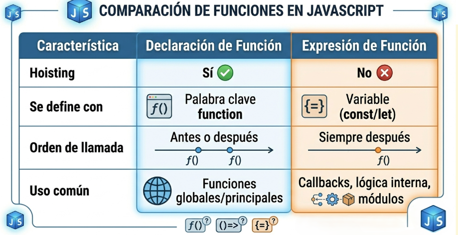

# Declaración de función vs expresión de función

En JavaScript, existen dos formas principales de definir funciones: la declaración de función (Function Declaration) y la expresión de función (Function Expression).
\
Aunque ambas permiten crear bloques de código ejecutables, presentan diferencias técnicas fundamentales en cuanto a su comportamiento, disponibilidad y sintaxis.

**Declaración de Función**

* Su sintaxis e&#x73;**:**

```javascript
function nombreFuncion(parametros) {
     // Bloque de codigo
     };
```

* Disponen de hoisting, lo que significa que el intérprete las carga en memoria durante la fase de compilación antes de ejecutar el script
  . Por ello, pueden ser llamadas antes de su definición en el código sin generar errores.
* Las declaraciones siempre tienen nombre, lo que facilita su identificación en el stack trace (pila de ejecución) cuando ocurre un error.
*   En modo estricto, las declaraciones de función tienen ámbito de bloque; si se definen dentro de un `if` o un bucle, solo son visibles dentro de ese bloque.\
    <br>

    ```javascript
    saludar("JavaScript"); // Funciona aunque la llamemos antes

    function saludar(lenguaje) {
        console.log("Hola, estamos aprendiendo " + lenguaje);
    ```

**Expresión de Función**

Una expresión de función asigna una función a una variable.  El nombre de la función es opcional  por lo que suelen ser anonimas.

* Su sintaxis es:

```javascript
const nombreFuncion = function(parámetros) {
    // Bloque de código
};
```

* No tienen hoisting
  &#x20;la función se crea solo cuando el flujo de ejecución alcanza esa línea específica, si se intenta llamar antes de su asignacion nos daria error.
* Como pueden ser anónimas, a veces las hace más complejas de inspeccionar. Sin embargo, si se asignan a una variable, muchos entornos modernos usan el nombre de la variable como nombre implícito para el rastre.
*   Es buena práctica ponerlo porque técnicamente estás declarando una variable.\
    <br>

    ```javascript
    const saludar = function(lenguaje) {
        console.log("Hola, estamos aprendiendo " + lenguaje);
    };

    saludar("Python"); // Funciona
    ```
*   <pre class="language-javascript" data-overflow="wrap"><code class="lang-javascript">saludar("C++"); // ReferenceError: Cannot access 'saludar' before initialization

    const saludar = function(lenguaje) {
        console.log("Hola, estamos aprendiendo " + lenguaje);
    };
    </code></pre>

    \
    &#x20;

&#x20;  &#x20;

<figure><figcaption></figcaption></figure>

