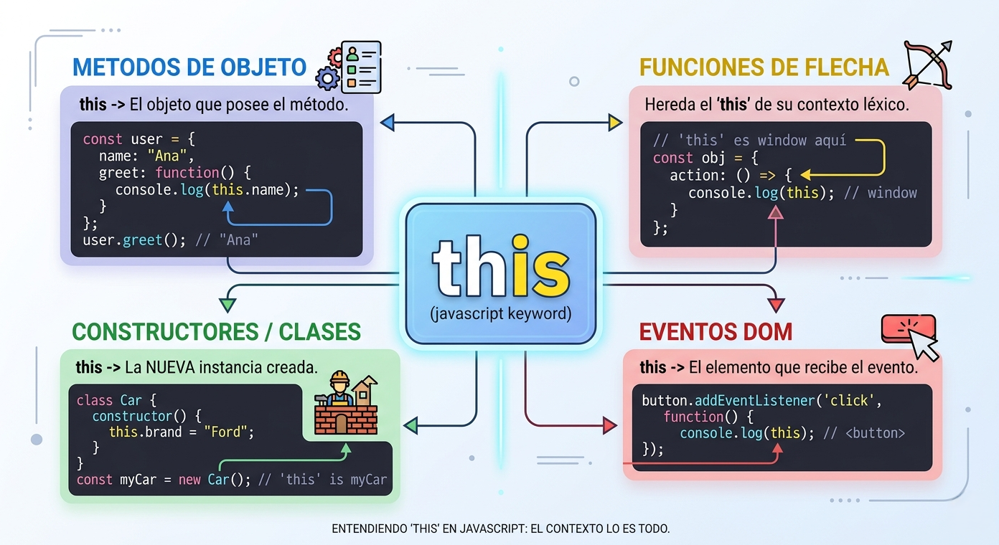

# This

En JavaScript, **this** es una palabra clave especial que hace referencia al objeto actual o al contexto de ejecución en el que se está invocando una función. A diferencia de otros lenguajes de programación, su valor no es estático ni se define por dónde se escribe la función, sino que se determina dinámicamente según cómo se llama a la función en tiempo de ejecución.

La palabra clave `this` es fundamental para interactuar con los objetos y sus datos de diversas maneras:

*   Acceso a miembros del objeto: Se utiliza dentro de un método para representar o llamar al objeto que dicha función está modificando, permitiendo acceder a sus propiedades y otros métodos.<br>

    ```javascript
    let lenguaje = {
        nombre: "JavaScript",
        tipo: "Front-end",

        mostrarInfo: function() {
            console.log(this.nombre + " es un lenguaje de " + this.tipo);
        }
    };

    lenguaje.mostrarInfo();
    // "JavaScript es un lenguaje de Front-end"
    ```
*   En constructores y clases: Cuando se crea una instancia con la palabra clave `new`, `this` se vincula automáticamente al nuevo objeto en construcción, permitiendo inicializar sus valores específicos.<br>

    ```javascript
    function Lenguaje(nombre, tipo) {
        this.nombre = nombre;
        this.tipo = tipo;
    }

    let js = new Lenguaje("JavaScript", "Web");
    let python = new Lenguaje("Python", "Data Science");

    console.log(js.nombre);     // "JavaScript"
    console.log(python.tipo);   // "Data Science"
    ```
* Manejo de eventos: En los controladores de eventos del DOM, `this` suele referirse al elemento de la interfaz que disparó la acción.
*

    ```javascript

    let boton = document.querySelector("button");

    boton.addEventListener("click", function() {
        console.log(this); // el botón que has pulsado
    });
    ```
*   Configuración explícita del contexto: Mediante los métodos `call()`, `apply()` y `bind()`, los desarrolladores pueden establecer manualmente a qué objeto debe apuntar `this`, independientemente de cómo se invoque la función.<br>

    ```javascript
    function mostrarLenguaje() {
        console.log("Lenguaje: " + this.nombre);
    }

    let js = { nombre: "JavaScript" };
    let py = { nombre: "Python" };

    mostrarLenguaje.call(js); // "Lenguaje: JavaScript"
    mostrarLenguaje.call(py); // "Lenguaje: Python"
    ```

Su existencia es vital para garantizar la flexibilidad y la reutilización del código en el desarrollo orientado a objetos:

*   Evita el acoplamiento fuerte: Sin `this`, un método tendría que referenciar el nombre exacto de la variable que contiene al objeto (por ejemplo, `persona1.nombre`). Si el nombre de la variable cambiara, el método dejaría de funcionar. Al usar `this.nombre`, el código se vuelve independiente del nombre del identificador externo.<br>

    ```javascript
    let lenguaje = {
        nombre: "JavaScript",
        mostrar: function() {
            console.log(this.nombre);
        }
    };
    ```
*   Reutilización de funciones: Permite que una misma función sea asignada como método a múltiples objetos diferentes. Al ejecutarse, `this` apuntará automáticamente al objeto que la invocó en ese momento, actuando sobre sus datos particulares.<br>

    ```javascript
    function mostrar() {
        console.log(this.nombre);
    }

    let js = { nombre: "JavaScript" };
    let py = { nombre: "Python" };

    js.mostrar = mostrar;
    py.mostrar = mostrar;

    js.mostrar(); // "JavaScript"
    py.mostrar(); // "Python"
    ```
*   Préstamo de funciones (Function borrowing): Permite utilizar los métodos de un objeto en otro distinto sin tener que duplicar la lógica ni mantener copias en lugares separados.<br>

    ```javascript
    let persona1 = {
        nombre: "Juan",
        saludar: function() {
            console.log("Hola, soy " + this.nombre);
        }
    };

    let persona2 = {
        nombre: "Ana"
    };

    persona1.saludar.call(persona2);
    // "Hola, soy Ana"
    ```
*   Resolución de problemas en callbacks: En situaciones asíncronas o de retorno de llamada, `this` permite que una función mantenga el rastro del objeto original, aunque para evitar "perder" esta referencia se suelen utilizar funciones flecha.<br>

    ```javascript
    let lenguaje = {
        nombre: "JavaScript",
        mostrar: function() {
            setTimeout(function() {
                console.log(this.nombre);
            }, 1000);
        }
    };

    lenguaje.mostrar(); // ❌ undefined

    //Solución con función flecha
    let lenguaje = {
        nombre: "JavaScript",
        mostrar: function() {
            setTimeout(() => {
                console.log(this.nombre);
            }, 1000);
        }
    };

    lenguaje.mostrar(); // "JavaScript"
    ```

    <br>

Reglas generales de su comportamiento

1.  Contexto global: Fuera de cualquier función, `this` hace referencia al objeto global (`window` en el navegador).<br>

    ```javascript
    console.log(this);
    ```
2.  Modo estricto: En funciones normales ejecutadas de forma simple, `this` es `undefined` para evitar modificaciones accidentales del objeto global.<br>

    ```javascript
    "use strict";

    function mostrar() {
        console.log(this);
    }

    mostrar(); // undefined
    ```
3.  Funciones flecha: Son una excepción importante ya que no tienen su propio this; en su lugar, capturan el valor de `this` del contexto léxico circundante donde fueron definidas.<br>

    ```javascript
    let lenguaje = {
        nombre: "JavaScript",
        mostrar: () => {
            console.log(this.nombre);
        }
    };

    lenguaje.mostrar(); // undefined
    ```

<br>

<figure><figcaption></figcaption></figure>
